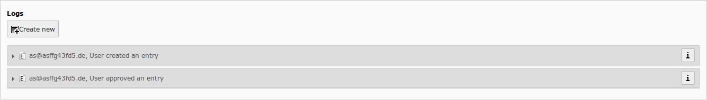
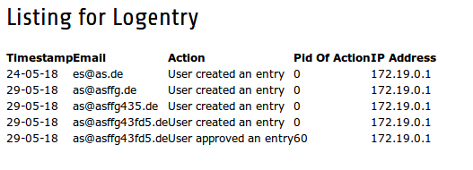

Extension Manual
=================

Description:
-----------
This extension adds logging to the [registeraddress](https://github.com/lsascha/registeraddress) extension.

This may be needed by law depending on your country if you use registeradress as newsletter subscription.

For example in germany you need to proof that a user unsubscribed/subscribed.

See https://www.e-recht24.de/artikel/ecommerce/6534-newsletter-rechtssicher-erstellen-und-versenden.html

Features:
-----------
So in general the extension will create log entries for the following user action: create/update/delete/approve.

The extension will log the IP address, email, timestamp of the action and consent text in a seperate table. So if the
tt_address data is deleted you still have  the logging proof.

The log entries are connected to the belonging tt_address data.

The Extension also provides a backend module to see all logging entries.

Installation:
-----------
1. Have registeraddress installed and ready
2. Install registeraddress_logger
3. Add static typoscript

Configuration:
-------------

In extension settings you can choose whether logs should be deleted after unsubscription (activated by default)

